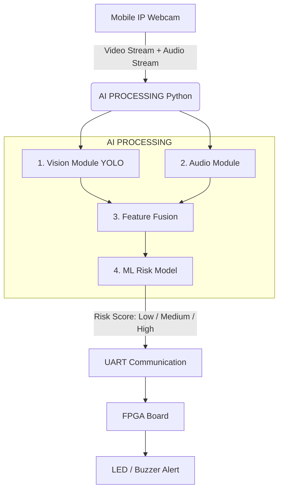

# 🧠 PROJECT TITLE

**AI-Based Predictive Crowd Congestion and Panic Alert System Using Multi-Sensor Fusion with FPGA**

## 🔍 1. CORE IDEA (IN SIMPLE WORDS)

The system continuously monitors a public area using:
- 📷 Camera (via mobile IP webcam)
- 🎤 Microphone (via mobile)

It then:
1. Detects how crowded the place is
2. Checks if people are behaving abnormally
3. Listens for panic sounds
4. Combines everything → calculates a risk score
5. Sends this score to FPGA → triggers LED / buzzer alerts

👉 **Goal:** Predict danger BEFORE a stampede happens.

---

## 🏗️ 2. SYSTEM ARCHITECTURE (DETAILED FLOW)



---

## 📷 3. DATA ACQUISITION (USING MOBILE IP WEBCAM)

**🔹 Why IP Webcam?**
Instead of expensive hardware, we use an Android phone camera and its built-in microphone.

**🔹 How it works**
1. Install IP Webcam app
2. Start server → gives URL like: `http://192.168.1.5:8080/video`

**🔹 In Python (OpenCV)**
```python
import cv2

url = "http://192.168.1.5:8080/video"
cap = cv2.VideoCapture(url)

while True:
    ret, frame = cap.read()
    cv2.imshow("Frame", frame)
    if cv2.waitKey(1) == 27:
        break
```

---

## 🎤 4. AUDIO INPUT (FROM MOBILE)

**🔹 Method**
Use mobile mic stream OR PC mic.
- **Option 1 (Simple):** Use laptop mic (recommended for stability)
- **Option 2 (Advanced):** Stream audio from IP Webcam

**🔹 Python (basic audio capture)**
```python
import sounddevice as sd
import numpy as np

audio = sd.rec(int(1 * 44100), samplerate=44100, channels=1)
sd.wait()

volume = np.linalg.norm(audio)
```

---

## 👁️ 5. VISION MODULE (YOLO – CROWD DETECTION)

**🔹 What YOLO does:**
- Detects people in each frame
- Draws bounding boxes
- Counts number of people

**🔹 Steps:**
1. Load pretrained YOLO model
2. Detect “person” class
3. Count detections

**🔹 Output:**
- Person count
- Bounding boxes
- Density estimate

**🔹 Example logic:**
```python
person_count = len(detections)

if person_count > 20:
    density = "HIGH"
elif person_count > 10:
    density = "MEDIUM"
else:
    density = "LOW"
```

---

## 🧭 6. CROWD ANALYSIS (IMPORTANT)

We analyze behavior, not just count people:
- 👥 Number of people
- 📊 Density per frame
- 🔄 Movement (optional advanced)
- ⚠️ Sudden clustering / dispersion

👉 *These become input features for the ML model.*

---

## 🔊 7. AUDIO MODULE (PANIC DETECTION)

**🔹 What you detect:** Sudden loud sounds, screaming / shouting.

**🔹 Basic approach (recommended):** Use sound intensity (decibel level).
```python
if volume > threshold:
    audio_state = "PANIC"
else:
    audio_state = "NORMAL"
```

**🔹 Advanced (optional):** MFCC features, train classifier.

---

## 🔗 8. MULTI-SENSOR FUSION

This is the main innovation. It combines Vision and Audio data.

**🔹 Example feature vector:** `[person_count, density_level, audio_level]`
*Example:* `[25, HIGH, PANIC]`

---

## 🤖 9. MACHINE LEARNING MODEL (RISK CLASSIFICATION)

**🔹 Goal:** Convert features → Risk Score
**🔹 Input:** Crowd density, Motion (optional), Audio state
**🔹 Output:** LOW RISK, MEDIUM RISK, HIGH RISK

**🔹 Model choices:**
- Logistic Regression ✅ (easy)
- Random Forest ✅ (better)
- SVM (optional)

**🔹 Example Logic:**
```python
if density == "HIGH" and audio == "PANIC":
    risk = "HIGH"
elif density == "MEDIUM":
    risk = "MEDIUM"
else:
    risk = "LOW"
```

---

## ⚡ 10. FPGA INTEGRATION

**🔹 Why FPGA?** Ultra fast, Real-time response, No delay like cloud.
**🔹 Communication:** Use UART (Serial Communication).

**🔹 Python side:**
```python
import serial

ser = serial.Serial('COM3', 9600)

if risk == "HIGH":
    ser.write(b'H')
elif risk == "MEDIUM":
    ser.write(b'M')
else:
    ser.write(b'L')
```

---

## 💡 11. FPGA LOGIC

**🔹 Input:** ‘H’, ‘M’, ‘L’ via UART
**🔹 Output:** LED, Buzzer
**🔹 Behavior:**
- LOW → Green LED
- MEDIUM → Yellow LED
- HIGH → Red LED + Buzzer

---

## 🔄 12. COMPLETE PIPELINE (FINAL FLOW)

1. Mobile streams video + audio
2. Python reads frames
3. YOLO detects people
4. Audio module detects panic
5. Features combined
6. ML model generates risk
7. Risk sent to FPGA
8. FPGA triggers alert

---

## 📊 13. EXPECTED OUTPUT

- Real-time video with detection
- Live crowd count
- Audio panic detection
- Risk level display
- Hardware alert (LED/Buzzer)

---

## 📈 14. PERFORMANCE METRICS

Must show:
- ✔ **Accuracy:** Correct detection of crowd
- ✔ **Latency:** Time from input → alert
- ✔ **False alarms:** Wrong panic detection
